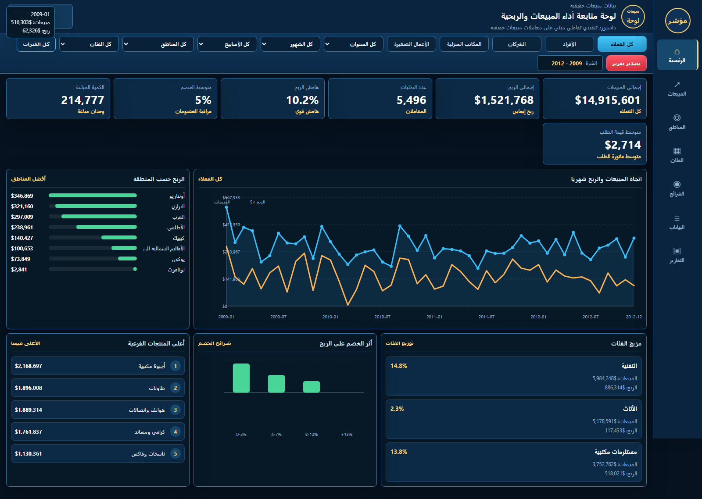

# Executive Sales Dashboard

A clean, interactive executive dashboard that turns retail sales transactions into clear, management-ready KPIs, trends, and reports. Built as a self-contained static web deliverable that runs in any modern browser with no server, database, or external dependencies.

## Project Overview

The Executive Sales Dashboard is a portfolio case study that shows how raw sales records can be transformed into a professional management interface. It presents the numbers that business owners, sales leaders, and regional managers care about on a single screen, and lets them filter the view by time period and customer segment.

This public version is provided for portfolio viewing. It demonstrates the finished dashboard experience using a representative retail dataset, without exposing any private client data, backend connections, or reusable processing service.

## Business Problem

Most businesses already collect sales data, but it usually sits in spreadsheets that are hard to read at a glance. Leaders need quick answers to questions such as:

- How much did we sell, and how much profit did we keep?
- Which regions and categories perform best?
- Are discounts helping or hurting margin?
- What is the trend month over month?

Without a clear dashboard, those answers take manual work and are easy to get wrong.

## Dashboard Objectives

- Give leadership a single, trustworthy view of sales performance.
- Make KPIs visible at a glance and easy to filter.
- Reveal regional and category strengths and weaknesses.
- Show how discounts affect profitability.
- Provide a print-ready report view for meetings.

## Key KPIs

| KPI | Description |
| --- | --- |
| Total Sales | Overall revenue across the selected period and segment. |
| Total Profit | Absolute profit generated. |
| Number of Orders | Count of transactions. |
| Profit Margin | Profit as a percentage of sales. |
| Average Discount | Mean discount applied to transactions. |
| Quantity Sold | Total units sold. |
| Average Order Value | Typical value of a single order (sales divided by orders). |

All KPIs update instantly when filters change.

## Data and Method

The dashboard runs on a representative retail sales dataset of **8,399 transactions** spanning **2009 to 2012**. Each record includes order date, region, category, sub-category, customer segment, sales, profit, quantity, and discount.

The data is loaded as a static JavaScript file and aggregated in the browser. No server, API, or database is involved, which keeps the deliverable portable and easy to host anywhere.

## Dashboard Features

- Seven headline KPI cards with live subtotals.
- Filters for period (year, month, week), region, category, and customer segment.
- Interactive charts with hover tooltips and highlighted data points.
- Monthly sales and profit trend chart.
- Profit comparison by region.
- Product category and sub-category performance.
- Discount impact analysis.
- Top-performing sub-categories ranking.
- A dedicated reports page with print and PDF export.
- Fully responsive layout for desktop and mobile.

## Business Value

The dashboard helps decision-makers move from "I think sales are up" to "sales are up 12% in the West region, driven by furniture, while discounts in the South are eroding margin." That shift supports faster, evidence-based decisions on pricing, inventory, and regional focus.

## Screenshots

### Dashboard overview



### Reports page


## Live Demo

The dashboard is published as a static site and can be opened from any device:

**https://khalid-data-portfolio.github.io/sales-dashboard-executive-reporting/**

## Repository Structure

```text
index.html                      # Entry point that opens the dashboard
web_dashboard/
  index.html                    # Main dashboard page (RTL Arabic)
  styles.css                    # Dashboard styling
  app.js                        # Charts, filters, and KPI logic
  data/
    sales_transactions.js       # Representative sales dataset
    dashboard_data.js           # Aggregated helper data
assets/
  executive_sales_dashboard_preview.png   # Full dashboard preview
  screenshots/                  # Additional preview images
README.md                       # This document
```

## How to Run

**Online:** open the Live Demo link above.

**Locally:** because the dashboard loads its data through JavaScript, open it from a small local web server rather than directly from the file system:

```bash
cd web_dashboard
python -m http.server 8000
```

Then visit `http://localhost:8000/` in your browser. (Use this only for local review; the published link above is the client-facing version.)

## Privacy Note

This public repository contains only a representative sample dataset and the dashboard interface. It does not include any real client data, credentials, private implementation notes, or backend connections. The dataset is intended for portfolio demonstration and is safe to share publicly.

## Tools Used

- HTML5, CSS3, and vanilla JavaScript
- In-browser SVG charts (no external chart library or CDN required)
- Responsive RTL layout for Arabic
- Hosted as a static site on GitHub Pages
