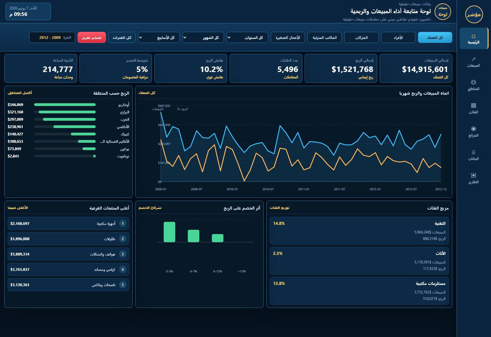
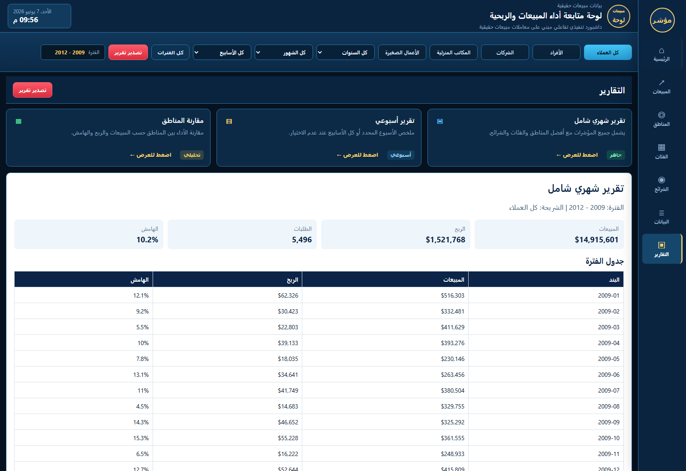

# Professional Sales Dashboard Portfolio

## Overview

This repository is a public portfolio case study for a professional sales dashboard. It shows how retail sales data can be transformed into a clear executive interface with KPIs, filters, charts, segmentation, regional analysis, and report views.

This public version is designed for portfolio viewing only. It demonstrates the final dashboard experience without exposing a reusable data-processing service.

## Dashboard Preview





## Live Dashboard

After enabling GitHub Pages, the dashboard can be viewed from the repository Pages URL:

```text
https://YOUR_USERNAME.github.io/09_interactive_sales_dashboard_service/
```

The root `index.html` redirects visitors directly to the dashboard.

## What This Project Shows

- Sales, profit, orders, margin, discount, and quantity KPIs.
- Filters by year, month, week, and customer segment.
- Monthly sales and profit trend.
- Regional profit comparison.
- Product category and sub-category performance.
- Discount impact analysis.
- Report page with print/PDF export.

## Public Version Boundaries

This public repository does not include:

- client data upload
- automated data cleaning pipeline
- reusable import workflow
- backend database connection
- private implementation notes

The dashboard is a completed case study and not a free self-service analytics tool.

## Service Summary

I build professional dashboards for sales teams, e-commerce stores, and business owners who need to turn raw sales files into clear KPIs, visual reports, and management-ready dashboards.
